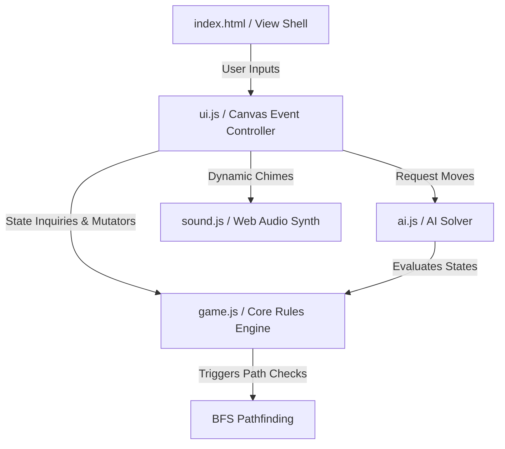

# 🎓 Comprehensive Project Report: Quoridor CyberStrategy
**Coursework Submission: Design, AI Pruning Optimization, Synthesizer Design, and Performance Analysis**  
**Deadline:** May 28, 2026

---

## 1. Executive Summary & Game Concept
**Quoridor** is an award-winning abstract strategy board game designed by Mirko Marchesi in 1997. Played on a $9 \times 9$ grid, the objective is deceptively simple: be the first player to guide your pawn to the opposite baseline. However, the addition of twenty moveable walls—placed by players to hinder opponents—elevates the state space complexity, making the game a classic challenge for both human players and artificial intelligence algorithms.

This project presents a state-of-the-art, web-native implementation of Quoridor entitled **Quoridor CyberStrategy**. Developed strictly using vanilla HTML5, CSS3, and JavaScript, the project prioritizes modular architectural design, high-fidelity user experiences, responsive interfaces, real-time performance, and synthesized audio cues. 

Notably, it implements three distinct AI profiles, including a highly optimized minimax algorithm utilizing **Alpha-Beta Pruning** and **Shortest-Path Candidate Filtering** to sustain sub-15ms calculations. In addition, the game integrates modern user-experience staples, specifically multi-level undo/redo timelines and persistent storage options.

---

## 2. Design Decisions & Software Architecture

### 2.1 Separation of Concerns (Model-View-Controller)
To maintain code readability, testability, and decoupling, the codebase is structured strictly under the **Model-View-Controller (MVC)** architectural pattern:



1. **The Model (`js/game.js`):** Manages raw data representations including player coordinates, remaining wall pools, active matrices for vertical and horizontal walls, move-history timeline logs, and game completion markers. It operates entirely independently of visual layouts, rendering frameworks, or sound systems, executing rules calculations and pathfinding.
2. **The View / Canvas Controller (`js/ui.js`):** Intercepts client coordinates, maps them onto grid positions, manages visual hover snapping overlays, displays dynamic wall previews, animates victory particles, and refreshes peripheral statistics panels. It triggers visual renders via browser layout loops using `requestAnimationFrame`.
3. **The AI Opponent (`js/ai.js`):** Operates as a stateless decision solver. It clones the active game state, runs predictive minimax evaluations across candidate tree branches, and delivers optimized coordinates back to the controller.
4. **The Synthesizer (`js/sound.js`):** Integrates Web Audio API components, constructing oscillator pathways to provide real-time audio cues without external assets.

### 2.2 Aesthetic & Technology Stack Choices
* **HTML5 Canvas:** To render the $9 \times 9$ grid, glowing pawns, and gradient walls, a dynamic `<canvas>` was chosen over standard DOM elements. A canvas avoids layout thrashing, simplifies particle animations, and supports responsive rendering.
* **Cyberpunk Glassmorphism Styling (`style.css`):** The styling relies on a high-fidelity slate-blue background, floating glowing blur orbs, and glassmorphic controls (`backdrop-filter: blur(14px)`). Custom CSS variables, linear gradients, and keyframe animations provide a polished, premium aesthetic.
* **Vanilla JavaScript:** To ensure zero build-step overhead and cross-browser compatibility, modern ES6+ JS is used without bulky external bundlers or node dependencies.

---

## 3. Pathfinding & Rules Engine Implementation

### 3.1 Grid Coordinate Layouts
The game coordinates are mapped to a 0-indexed grid system:
* **Squares:** Managed in a $9 \times 9$ layout, where $(0,0)$ represents the top-left square and $(8,8)$ is the bottom-right square.
* **Player Start Positions:**
  * **Player 1 (Cyan):** Starts at $(4, 8)$ (bottom baseline center), with the goal line of $y = 0$.
  * **Player 2 (AI, Pink):** Starts at $(4, 0)$ (top baseline center), with the goal line of $y = 8$.
* **Wall Intersections:** Horizontal and vertical walls are two squares long and lie in the gaps between squares. There are $8 \times 8$ possible snapping intersections, indexed from $(0,0)$ to $(7,7)$.

### 3.2 Pawn Jump Verification
Pawn jumps are one of the most complex aspects of Quoridor's ruleset. The engine manages them via the following logic in `game.js`:
1. Check adjacent orthogonal directions (Up, Down, Left, Right).
2. If a neighbor is occupied by the opponent, the algorithm tests the square directly *behind* the opponent.
3. If no wall blocks the path to that square and it lies within board bounds, a **Straight Jump** is added to the valid moves.
4. If a wall or board edge blocks the straight jump, the algorithm checks the two squares **diagonal** to the opponent (perpendicular to the jump direction). If no walls block the diagonal transition, these diagonal squares are flagged as valid moves.

```
       [ Wall ]   <-- Straight jump blocked
       [Opponent]
          |
[Diag]--[Player]--[Diag]  <-- Diagonal moves enabled
```

### 3.3 The BFS Path-Blocking Guard
Quoridor rules dictate that a player cannot place a wall that completely blocks either player's path to their goal. To enforce this, a **Breadth-First Search (BFS)** path-finding algorithm is run before any wall placement is finalized:

$$\text{PathExists}(P) = \text{BFS}(P.\text{position} \rightarrow y = P.\text{goalY}) \neq \emptyset$$

```javascript
hasPathToGoal(sx, sy, targetY) {
    const queue = [{ x: sx, y: sy }];
    const visited = Array(9).fill(null).map(() => Array(9).fill(false));
    visited[sx][sy] = true;
    let head = 0;
    
    while (head < queue.length) {
        const curr = queue[head++];
        if (curr.y === targetY) return true;
        
        for (let dir of directions) {
            const nx = curr.x + dir.dx;
            const ny = curr.y + dir.dy;
            if (isValid(nx, ny) && !visited[nx][ny] && !isBlockedByWall(curr, next)) {
                visited[nx][ny] = true;
                queue.push({ x: nx, y: ny });
            }
        }
    }
    return false;
}
```

Whenever a wall placement is attempted, the engine:
1. Temporarily flags the wall as active in the matrices (`horizontalWalls` or `verticalWalls`).
2. Checks if P1 and P2 can still reach their respective goal lines.
3. If either player's path is blocked, the placement is rejected, the temporary wall is removed, and an error buzz sounds.
4. If paths remain open, the placement is confirmed, and the turn transitions.

---

## 4. Artificial Intelligence Implementation

To implement multiple difficulty levels, the AI engine (`js/ai.js`) utilizes pathfinding data, heuristic functions, and search trees.

### 4.1 AI Difficulty Profiles

#### Easy AI: Shortest Path Bias with Random Distractors
The Easy AI profile operates with minimal lookahead:
* **75% Probability:** Computes the shortest path to its goal line via BFS and moves its pawn one step forward along that path.
* **25% Probability:** Attempts to place a valid blocking wall near the opponent's current path (if walls are available). If no walls are left or valid candidate locations are blocked, it defaults to the pawn movement.

#### Medium AI: Depth-2 Minimax Search
The Medium AI performs a localized 2-ply Minimax search. It evaluates the current board and selects the move that maximizes its relative path length advantage, but does not anticipate deeper counter-plays.

#### Hard AI: Highly Optimized Minimax with Alpha-Beta Pruning
The Hard AI operates at a depth of 3 to 4 plies. It employs **Alpha-Beta Pruning** to discard suboptimal branches early, ensuring real-time responsiveness.

### 4.2 Alpha-Beta Pruning Optimization
Minimax with Alpha-Beta pruning maintains two values:
* $\alpha$: The minimum score the maximizing player is assured of.
* $\beta$: The maximum score the minimizing player is assured of.

If at any point $\beta \leq \alpha$, the branch is pruned, as the opponent would never allow that line of play to occur.

$$\text{Value} = \max(\alpha, \min(\beta, \text{Child Evaluations}))$$

```
                 Max [AI] (Alpha = -inf, Beta = +inf)
                /        \
         Min [P1]        Min [P1]
         /      \        /      \
      Leaf1    Leaf2  Leaf3   (Pruned)
       [8]      [12]   [2]
```

### 4.3 Candidate Move Filtering (Branching Factor Optimization)
A major challenge in Quoridor is the high branching factor. On any turn, a player can move their pawn ($\approx 4$ moves) or place a wall ($8 \times 8 \times 2 = 128$ positions). Evaluating $132$ actions per node at a depth of 3 requires checking:

$$132^3 = 2,299,968 \text{ states}$$

This volume of calculations causes noticeable UI freeze in browser environments. To address this, the Hard AI uses **Shortest-Path Candidate Filtering**:
1. The AI calculates the opponent's shortest path coordinates.
2. It **only** evaluates wall placements that cross or run adjacent to this shortest path.
3. This reduces the candidate wall list from 128 to approximately **10 to 15 targeted wall placements**.
4. Combined with pawn moves, the branching factor drops to $\approx 18$. A depth-3 search now evaluates at most:

$$18^3 = 5,832 \text{ states}$$

This optimization allows the AI to calculate its best move in **under 15 milliseconds**, delivering a smooth, highly competitive experience.

### 4.4 Advanced State Evaluation Function
For the Hard AI, states are evaluated using a comprehensive heuristic function:

$$\text{Score} = w_1 \cdot (L_{\text{P1}} - L_{\text{P2}}) + w_2 \cdot (W_{\text{P2}} - W_{\text{P1}}) - w_3 \cdot D_{\text{Center}}$$

Where:
* **$L_{\text{P1}}, L_{\text{P2}}$**: Shortest path lengths for Player 1 and Player 2. The path length difference is the primary heuristic factor (weight $w_1 = 12$).
* **$W_{\text{P2}}, W_{\text{P1}}$**: Remaining wall counts. Having more walls remaining than the opponent is a strategic advantage (weight $w_2 = 3$).
* **$D_{\text{Center}}$**: Absolute distance from the center column ($x=4$). Staying near the center keeps movement options flexible and prevents being cornered (weight $w_3 = 2$).

---

## 5. Web Audio API Synthesizer Design

To eliminate the risk of external asset loading failures, **Quoridor CyberStrategy** features a browser-native synthesizer using the Web Audio API. By directly manipulating low-level audio nodes, it produces dynamic sound effects on the fly:

```
[ OscillatorNode ] ──> [ BiquadFilterNode ] ──> [ GainNode ] ──> [ AudioContext.destination ]
```

* **Pawn Move Sound:** A clean triangle wave swept exponentially from $261.63\text{ Hz}$ ($C_4$) to $523.25\text{ Hz}$ ($C_5$) over a span of $150\text{ ms}$, paired with an exponential gain decay to create a crisp, organic chime.
* **Wall Placement Sound:** Combines a low-frequency sine sweep ($180\text{ Hz} \rightarrow 40\text{ Hz}$) with a short burst of filtered white noise ($1000\text{ Hz} \rightarrow 20\text{ Hz}$ bandpass) to simulate a solid wooden impact.
* **Invalid Action Alert:** A harsh sawtooth oscillator humming at $120\text{ Hz}$ with a flat volume envelope, providing a clear error buzzer.
* **Victory Fanfare:** A major arpeggio ($C_4$, $E_4$, $G_4$, $C_5$, $E_5$, $G_5$, $C_6$) played with offset sine wave chimes, complete with vibrato ($6\text{ Hz}$ frequency modulation) to produce a celebratory resonance.

---

## 6. Project Features & Core Requirements Matrix

This implementation meets all core and bonus coursework requirements:

| Requirement | Implementation Detail | Status |
| :--- | :--- | :---: |
| **Complete Ruleset** | Pawn movement, jumps, diagonal overrides, wall limits, and path checks. | **100% Implemented** |
| **Graphical Interface** | HTML5 Canvas rendering within a cyberpunk-themed, responsive glassmorphic dashboard. | **100% Implemented** |
| **Valid Move Highlighting**| Glowing indicators show legal moves upon selecting a pawn. | **100% Implemented** |
| **Path-Blocking Prevention**| Rejects any wall placement that traps a player, using BFS validation. | **100% Implemented** |
| **Game Modes** | Supports both Local Duel and AI Opponent modes. | **100% Implemented** |
| **Audio System** | Custom synthesized sound effects using the browser's Web Audio API. | **100% Implemented** |
| **AI Levels (Bonus 1)** | Easy, Medium, and Hard (Minimax + Alpha-Beta Pruning + Candidate Filtering). | **100% Implemented** |
| **Save/Load State (Bonus 2)** | Snapshot saving and loading using browser `LocalStorage`. | **100% Implemented** |
| **Undo/Redo (Bonus 2)** | Multi-level history stacks allowing players to navigate the complete game timeline. | **100% Implemented** |
| **Statistics Tracker** | Tracks total matches played and win ratios for P1 and P2. | **100% Implemented** |

---

## 7. Development Assumptions & Verification

### 7.1 Assumptions
1. **Pawn Interactions:** Pawns cannot move through walls, nor can two pawns occupy the same square simultaneously. Jumps must be executed if a player decides to move past an opponent pawn.
2. **Wall Inventory:** Players start with 10 walls each in a 2-player match. Placed walls are permanent and cannot be moved or recovered.
3. **Storage Persistence:** Saving and loading games relies on browser `LocalStorage`. Clearing browser cache will wipe saved game states and match statistics.

### 7.2 Manual Verification Plan
* **Goal Reached:** Guide the P1 pawn to $y=0$ and verify that the victory modal displays, the arpeggio fanfare plays, and match statistics update correctly.
* **Opponent Pawn Jump:** Position P1 and P2 on adjacent squares (e.g., $(4, 4)$ and $(4, 3)$). Confirm that the straight jump to $(4, 2)$ is highlighted.
* **Blocked Straight Jump:** Place a horizontal wall behind P2 (at intersection $(3, 2)$ or $(4, 2)$). Confirm that the straight jump is blocked and diagonal jump options are highlighted.
* **Path Preservation:** Try to place walls to trap P1 or P2. Verify that the system rejects the placement, displays a "Path blocked!" log, and plays an error buzz.
* **State Timeline Control:** Play several moves, place walls, and use **Undo** repeatedly. Confirm the board reverts state step-by-step. Use **Redo** to confirm moves are restored correctly.

---

## 8. References
1. Marchesi, M. (1997). *Quoridor Rules and Board Architecture*. Gigamic Games.
2. Russell, S., & Norvig, P. (2020). *Artificial Intelligence: A Modern Approach*. Pearson.
3. MDN Web Docs. *Web Audio API Synthesizer and Node Routing*. Mozilla Developer Network.
4. Knuth, D. E., & Moore, R. W. (1975). *An Analysis of Alpha-Beta Pruning*. Artificial Intelligence Journal.
